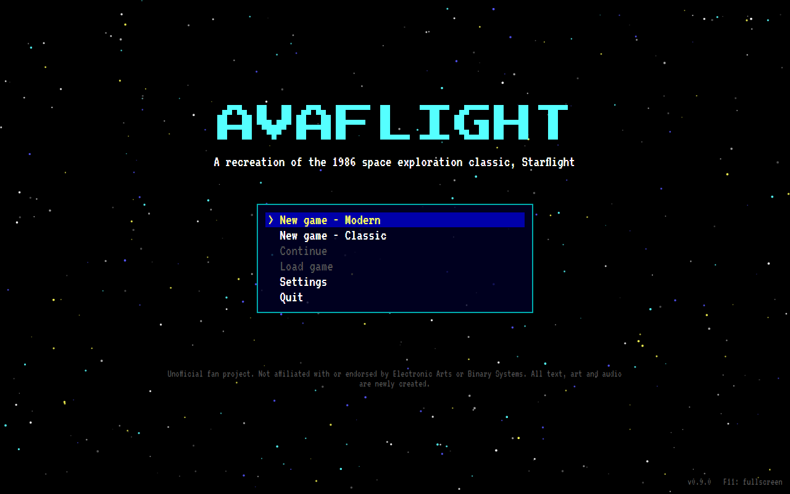
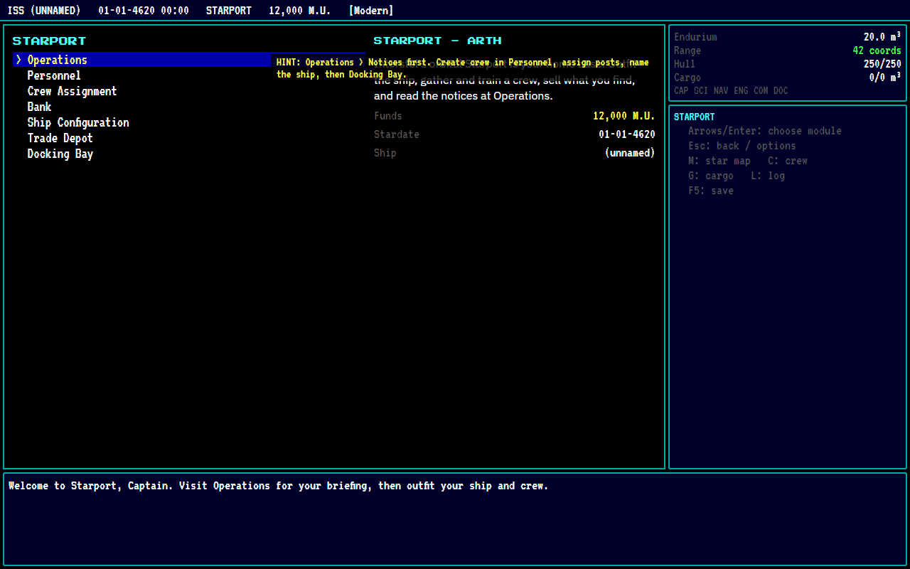
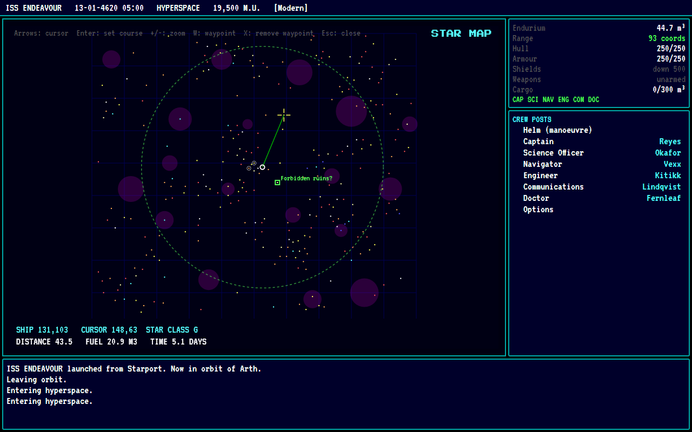
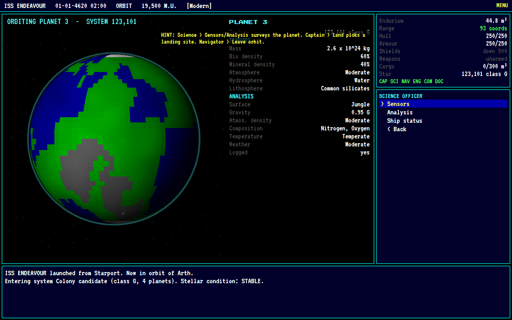
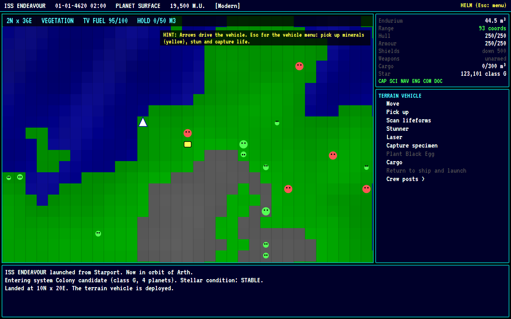
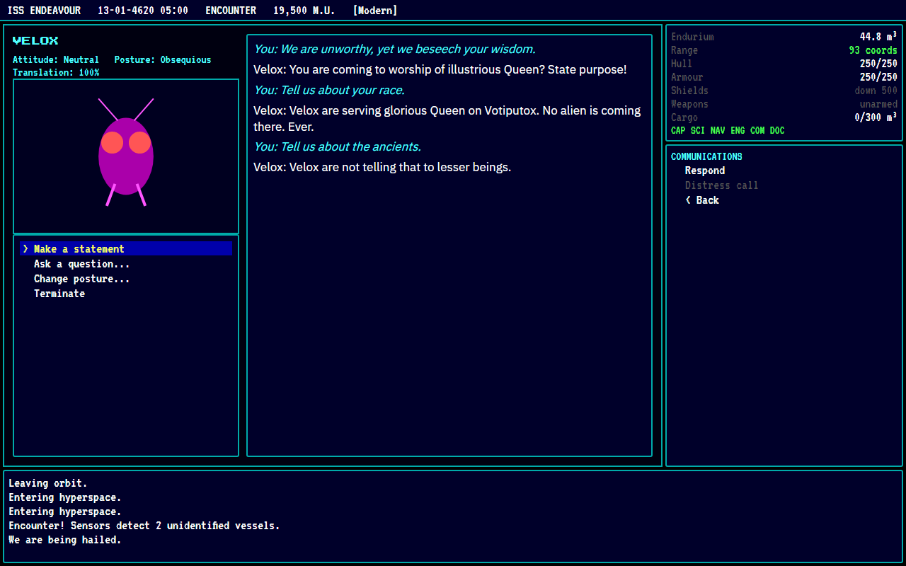
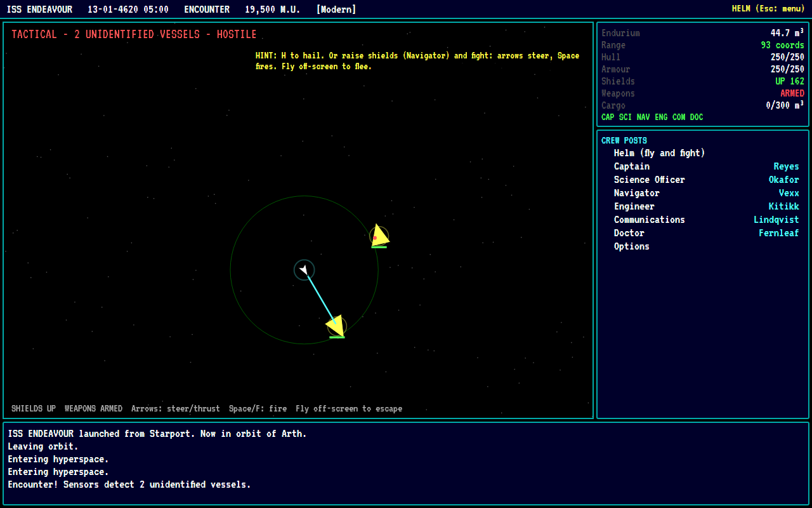

# AVAFlight

**AVAFlight** is a recreation of *Starflight*, the 1986 space exploration RPG. It is built with **.NET 10** and **Avalonia 12** for Windows, Linux and macOS, and plays fully offline as a single-player game.

You fly from Starport on Arth to explore 270 star systems and 811 planets. Along the way you:

- train and manage a six-post crew
- outfit your ship
- mine planets and capture alien life
- negotiate with alien races
- uncover what is igniting the stars before Arth's sun flares

There are two presets:

- **Classic** follows the documented 1986 DOS behaviour.
- **Modern** keeps every rule and number the same, and adds conveniences: an automatic captain's log, waypoints, a fuel-range ring, tooltips, a pause hotkey and named saves.

> Unofficial fan project. Not affiliated with or endorsed by Electronic Arts or Binary Systems. All text, art and audio are newly created, and no original game data is included. See [docs/THIRD_PARTY.md](docs/THIRD_PARTY.md).



## Prerequisites

- **.NET SDK 10.0.400 or later.** `global.json` pins the 10.0.400 SDK with `rollForward: latestFeature`.
- **Linux:** an X11 or XWayland session with fontconfig. **macOS / Windows:** nothing extra.
- Audio and gamepad support (SDL3) are bundled. If they can't be initialised, the game runs silently.

## Build, run, test

```bash
dotnet build                                      # whole solution
dotnet run --project src/AVAFlight.Avalonia       # play (add -- --mute to disable audio)
dotnet test                                       # 85 headless tests (engine, infrastructure, UI)
tools/screenshots.sh                              # regenerate docs/screenshots/*.png
```

## Publish (self-contained single file)

```bash
./publish.sh                    # win-x64 linux-x64 osx-x64 osx-arm64 -> publish/<rid>/AVAFlight[.exe]
./publish.sh linux-arm64        # any other runtime identifier
pwsh ./publish.ps1              # Windows / PowerShell equivalent
```

Each target can also be published individually:

```bash
dotnet publish src/AVAFlight.Avalonia -c Release -r win-x64   --self-contained -p:PublishSingleFile=true
dotnet publish src/AVAFlight.Avalonia -c Release -r linux-x64 --self-contained -p:PublishSingleFile=true
dotnet publish src/AVAFlight.Avalonia -c Release -r osx-x64   --self-contained -p:PublishSingleFile=true
dotnet publish src/AVAFlight.Avalonia -c Release -r osx-arm64 --self-contained -p:PublishSingleFile=true
```

To verify a published binary, run `publish/<rid>/AVAFlight --smoke-test`. It prints `AVAFLIGHT_SMOKE_OK: main menu reached` and exits with code 0.

Verification so far:

- **linux-arm64:** run and verified.
- **The four required targets:** built, and their binary formats checked, but **not yet run on their native platforms**. See [docs/KNOWN_ISSUES.md](docs/KNOWN_ISSUES.md).

## Documentation

| Document | Contents |
|---|---|
| [docs/GAMEPLAY.md](docs/GAMEPLAY.md) | Player guide and controls |
| [docs/RESEARCH.md](docs/RESEARCH.md) | Research dossier, source ledger, open questions |
| [docs/FIDELITY.md](docs/FIDELITY.md) | Reference version, fidelity matrix, Classic vs Modern |
| [docs/ARCHITECTURE.md](docs/ARCHITECTURE.md) | Projects, engine, time models, rendering, input, audio, publishing |
| [docs/SAVES.md](docs/SAVES.md) | Save locations, format, versioning |
| [docs/THIRD_PARTY.md](docs/THIRD_PARTY.md) | Licences and asset provenance |
| [docs/KNOWN_ISSUES.md](docs/KNOWN_ISSUES.md) | Caveats and unverified items |
| [docs/MILESTONE_STATUS.md](docs/MILESTONE_STATUS.md) | Milestone status and next tasks |

## Screenshots

| | |
|---|---|
|  Starport |  Star map |
|  Planet survey |  Terrain vehicle |
|  Alien contact |  Combat |

All 17 screenshots are in [docs/screenshots](docs/screenshots).

## License

MIT. See [LICENSE](LICENSE). Bundled fonts are under the SIL Open Font License (`licenses/`); see THIRD_PARTY.md.
